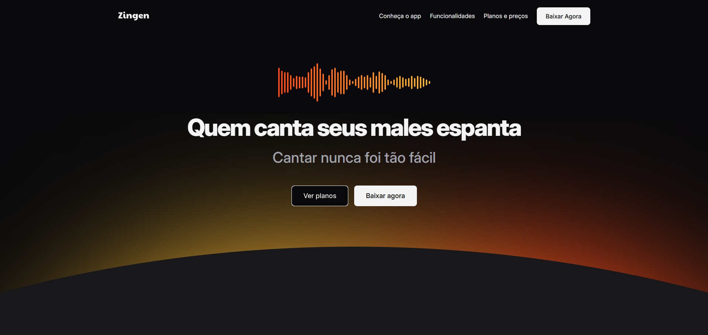

# 🎤 Zingen - Karaokê

**Landing page** de um aplicativo de **Karaokê com Inteligência Artificial** chamado Zingen. O projeto simula a página de um produto SaaS completo, com seção hero, apresentação do app, funcionalidades, planos de assinatura e call-to-action para download. Desenvolvido com foco em **CSS moderno** e **arquitetura modular**.

## 📸 Preview

 

## 🚀 Demonstração

🔗 [Acesse o site](https://rochacode08.github.io/Zingen/)

## 🛠️ Tecnologias utilizadas

- **HTML5** — estruturação semântica com `<header>`, `<section>`, `<main>`, `<footer>`, `<article>`
- **CSS3** — estilização com **Flexbox**, **CSS Grid**, CSS Nesting e Custom Properties
- **Google Fonts** — tipografia com a fonte *Inter*

## ✨ Funcionalidades e destaques

- ✅ **Landing page completa** com 7 seções (header, hero, about, features, pricing, download, footer)
- ✅ **Design dark mode** elegante com destaque em gradiente laranja-amarelo
- ✅ **Gradientes de texto** usando `background-clip: text` para efeitos visuais
- ✅ **Botões com borda em gradiente** usando técnica de pseudo-elementos (`::before` / `::after`)
- ✅ **Seção de features** com grid avançado (4 colunas × 2 linhas com `grid-column` e `grid-row`)
- ✅ **Card Premium destacado** com borda em gradiente e badge "1 mês grátis"
- ✅ **Ícones sociais** com troca de imagem no hover via CSS Variables
- ✅ **Scroll suave** com `scroll-behavior: smooth`
- ✅ **Efeitos de hover** em links, botões e ícones sociais
- ✅ **Arquitetura CSS modular** com 13 arquivos separados por responsabilidade
- ✅ **Media queries com range syntax** moderna (`width >= 80em`)
- ✅ **Uso de Custom Elements** com a tag `<zin-pricing>` para semântica personalizada

## 🎨 Paleta de cores

Tema dark com gradiente laranja/amarelo como identidade visual:

| Cor                    | Hex       |
| ---------------------- | --------- |
| ⬛ Background            | `#09090B` |
| 🟥 Surface              | `#18181B` |
| 🔲 Stroke               | `#27272A` |
| ⚪ Texto Primário        | `#F4F4F5` |
| 🔘 Texto Secundário     | `#A1A1AA` |
| 🟡 Brand Primary        | `#F7B733` |
| 🟠 Brand Secondary      | `#FC4A1A` |

## 📂 Estrutura do projeto

```
📦 zingen
 ┣ 📂 assets
 ┃ ┣ 📂 icons              → Ícones SVG (features e redes sociais)
 ┃ ┣ 🖼️ logo.svg
 ┃ ┣ 🖼️ music-bars.svg
 ┃ ┣ 🖼️ bg-hero-desktop.svg
 ┃ ┣ 🖼️ illustration.svg
 ┃ ┣ 🖼️ smartphones.png
 ┃ ┗ 🖼️ (demais imagens do app)
 ┣ 📂 styles
 ┃ ┣ 📜 index.css           → Arquivo principal (importa todos os outros)
 ┃ ┣ 📜 global.css          → Reset, variáveis e estilos globais
 ┃ ┣ 📜 utility.css         → Classes utilitárias (container, flex, grid, py, px)
 ┃ ┣ 📜 buttons.css         → Sistema de botões (sm, md, lg)
 ┃ ┣ 📜 social.css          → Ícones das redes sociais
 ┃ ┣ 📜 header.css          → Estilos do cabeçalho
 ┃ ┣ 📜 hero.css            → Seção Hero (tela principal)
 ┃ ┣ 📜 sections.css        → Estilos comuns entre seções
 ┃ ┣ 📜 about.css           → Seção "Conheça o app"
 ┃ ┣ 📜 cards.css           → Estilos base dos cards
 ┃ ┣ 📜 features.css        → Seção de funcionalidades
 ┃ ┣ 📜 pricing.css         → Seção de planos e preços
 ┃ ┣ 📜 download.css        → Seção de download
 ┃ ┗ 📜 footer.css          → Rodapé
 ┗ 📜 index.html             → Página principal
```

## 💻 Como rodar o projeto

Clone o repositório:

```bash
git clone https://github.com/rochacode08/Zingen.git
```

Acesse a pasta do projeto:

```bash
cd Zingen
```

Abra o arquivo `index.html` no navegador — ou utilize a extensão **Live Server** do VS Code para recarregamento automático.

> 💡 **Recomendação:** esse projeto foi pensado para visualização em desktop (acima de 1280px). Em telas menores, o layout é adaptado para mobile.

## 📚 O que eu aprendi

Este foi o projeto mais complexo que desenvolvi até aqui, e consegui aplicar **muitos conceitos avançados de CSS**:

### 🎨 CSS Moderno
- **CSS Custom Properties** em múltiplos níveis (globais e locais por componente)
- **CSS Nesting** nativo (sem precisar de pré-processador como SASS)
- **Range queries** modernas em media queries (`width >= 80em`)
- **Import condicional** de arquivos CSS com `@import url() (condição)`
- **CSS Custom Elements** (`<zin-pricing>`) para semântica personalizada

### 🏗️ Arquitetura
- Organização de CSS em **13 arquivos modulares** por responsabilidade
- Separação de **estilos base**, **utilitários** e **componentes**
- Design System consistente através de variáveis CSS
- Classes utilitárias no estilo **Tailwind** (`.py-base`, `.gap-1`, `.flex`)

### 💎 Técnicas visuais
- **Texto com gradiente** usando `background-clip: text`
- **Borda em gradiente** usando pseudo-elementos `::before`
- **Botões com label dinâmico** via `content: attr(aria-label)`
- **Ícones sociais** com troca de imagem no hover usando CSS Variables
- **Filter drop-shadow** em imagens PNG com transparência

### 📐 Layout avançado
- **CSS Grid** complexo com `grid-template-columns`, `grid-template-rows` e `grid-column`
- **Flexbox** com `flex-wrap` e alinhamentos diversos
- Uso de `width: min()` para containers responsivos
- Posicionamento absoluto em elementos complexos

### ♿ Acessibilidade e semântica
- Uso de `role="list"` para listas estilizadas
- Uso de `aria-label` em botões sem texto visível
- HTML semântico com `<header>`, `<section>`, `<footer>`, `<nav>`

## 🔮 Melhorias futuras

- [ ] Refinar a responsividade no intervalo entre 426px e 1279px
- [ ] Adicionar animações de entrada ao fazer scroll (scroll reveal)
- [ ] Implementar carrossel de depoimentos de usuários
- [ ] Criar menu hamburguer funcional no mobile
- [ ] Adicionar modo claro (light mode) com toggle
- [ ] Integrar formulário de newsletter real
- [ ] Implementar animações nas barras de música do hero

## 📝 Licença

Este projeto foi desenvolvido apenas para fins **educacionais e de estudo**.

---

## 👨‍💻 Autor
Desenvolvido com 💙 por **[Gabriel Rocha Lopes](https://github.com/rochacode08)**

<a href="mailto:gabrielrocha.devstack@gmail.com">
    
</a>
<a href="https://www.linkedin.com/in/gabriel-rocha-devstack">
    
</a>
<a href="https://www.instagram.com/gabriel_lopess15/">
    
</a>

---